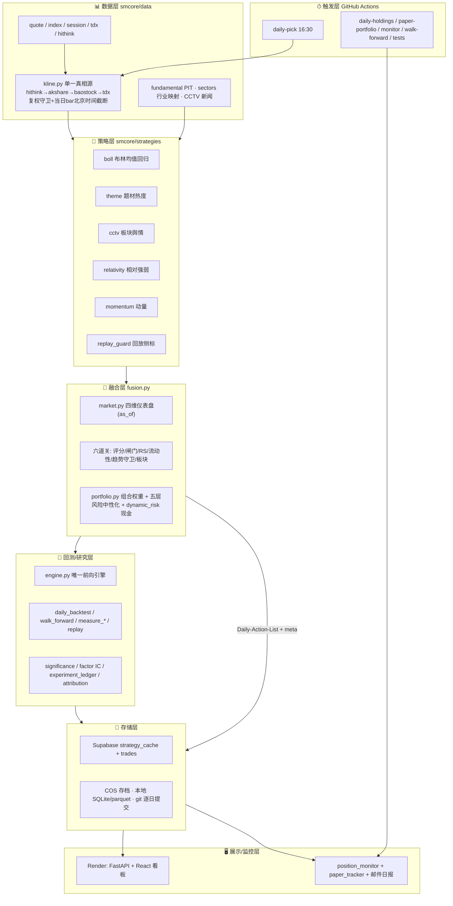

# Stocks-Master 完整架构图

> 2026-09-12 生成，与代码实际状态对齐（含 09-11/12 两轮修复）。持续维护本文件，
> 结构变更时同步更新。

## 1. 全景分层图（ASCII）

```text
═══════════════════════════════════════════════════════════════════════════
 ⏱ 触发层（GitHub Actions，cron 均为北京时间）
═══════════════════════════════════════════════════════════════════════════
  daily-pick.yml  工作日 16:30 ── 选股→融合→回测 全链路（job 90min）
  daily-holdings.yml / paper-portfolio.yml / monitor.yml / walk-forward.yml
  keep-alive.yml（Render 保活）/ tests.yml（PR + 定期）
        │  缓存优先：strategy_cache pull 命中即跳过
        ▼
═══════════════════════════════════════════════════════════════════════════
 📊 数据层  smcore/data/
═══════════════════════════════════════════════════════════════════════════
  kline.py ── 日K单一真相源（强制前复权 qfq）
    │  后端回退链: hithink → akshare(新浪) → baostock → tdx
    │  守卫: 复权漂移检测+物理自洽 / 当日未收盘bar按北京时间15:30截断(UTC+8显式)
    │        / 盘后自愈 / 坏bar整只剔除告警
    │  缓存: stock_data/k_data/*.parquet 分桶（覆盖+fresh 短路）
  quote.py / quote_sina.py ── 实时报价（5min TTL 双层缓存）
  index.py ── 指数行情（sqlite 缓存）
  session.py ── baostock 单例登录   tdx_client.py ── 通达信直连
  hithink.py / hithink_special.py ── 同花顺付费源（板块动量/异动/复权解释）
        │
        ├── fundamental.py ── 基本面 PIT（pubDate 优先 + 法定滞后兜底）
        ├── sectors.py ── 行业映射 sector_map.json（baostock 按需累积）
        └── cctv 数据源 ── 新闻联播 + cls/sina 补充资讯
        ▼
═══════════════════════════════════════════════════════════════════════════
 🎯 策略层  smcore/strategies/  （每日 16:30 并行，各自产出 CSV）
═══════════════════════════════════════════════════════════════════════════
  boll.py        布林均值回归（主策略）→ Stock-Selection-Boll-*.csv
  theme.py       题材热度/换手      → Stock-Selection-Ashare-Theme-Turnover-*.csv
  cctv.py        新闻联播板块舆情   → CCTV-Sector-Stock-Pool-*.csv
  relativity.py  相对强弱           → Stock-Selection-Relativity-*.csv
  momentum.py    动量/相对强度      → Stock-Selection-Momentum-*.csv
  统一纪律：ST/停牌过滤；重放走 REPLAY_MODE（跳过实时因子 + universe_pit 侧标）
  replay_guard.py ── 回放可信度侧标 *.meta.json
        ▼
═══════════════════════════════════════════════════════════════════════════
 🧠 融合层（决策中枢）  smcore/strategy/fusion.py
═══════════════════════════════════════════════════════════════════════════
  market.py compute_market_profile(as_of=信号日) ── 四维仪表盘
    趋势(MA20/60+斜率) / 波动率分位 / 宽度(300+500+1000) / 量能
  六道关：①自适应评分(adaptive_weights: softmax(edge)+收缩+清零门)
          ②趋势闸门(下行防御剔纯均值回归) ③RS过滤(regime_filter 动态tol)
          ④流动性门槛(动态) ⑤趋势守卫(MA20破位) ⑥板块轮动+集中度
  组合构建 portfolio.py compute_target_weights(score_weighted/ERC)
  风险中性化 position_sizing.py：单名/单策略/单行业/行业权重/β 五层
  dynamic_risk.py ── 现金比例(波动率S曲线+regime+回撤熔断)
        ▼
═══════════════════════════════════════════════════════════════════════════
 📋 产物层  stock_data/
═══════════════════════════════════════════════════════════════════════════
  Daily-Action-List-YYYYMMDD.csv + .meta.json（regime/时间钉死标记）
  各策略 CSV / Multi-Backtest-*/ Multi-Strategy-Report-*
  回放产物带 universe_pit=false 侧标
        ▼
═══════════════════════════════════════════════════════════════════════════
 🔬 回测/研究层（单一前向引擎 + 研究脚本）
═══════════════════════════════════════════════════════════════════════════
  backtest/engine.py run_forward_signal_backtest ── 唯一前向回测引擎
    次日开盘买/T+1/整手/缺口止损/分批止盈/移动止盈/MA60破位(策略路由)/
    涨跌停(板块10/20/30%)/停牌按最后已知价盯市/佣金+印花税+滑点
    ↑ 委托源：signal_backtest.run_signal_backtest(web) · daily_backtest 内联过滤(同源)
  scripts/daily_backtest.py ── 每日前向回测（内联过滤=生产同源动态阈值）
  scripts/walk_forward_validator.py ── 扩展窗口 walk-forward + 出场参数扫描
  scripts/measure_*.py / replay_history.py / replay_current_rules.py
  significance.py(Deflated Sharpe) · factor_scoring/ml_factors(IC) ·
  experiment_ledger.py(实验台账) · attribution.py(Brinson 归因)
        ▼
═══════════════════════════════════════════════════════════════════════════
 💾 存储层
═══════════════════════════════════════════════════════════════════════════
  Supabase: strategy_cache(策略缓存) + 交易记录 trades_repo
  腾讯 COS: 操作清单存档    本地: SQLite + parquet + JSON 缓存
  git: 结果 CSV 逐日提交（供追溯与 walk-forward）
        ▼
═══════════════════════════════════════════════════════════════════════════
 🖥 展示/监控层
═══════════════════════════════════════════════════════════════════════════
  Render: backend/main.py (FastAPI) → frontend (React) 看板
    指数/热度/选股/持仓/回测 API · admin 管理(限流+锁定) · api_auth
  position_monitor.py: 持仓监控 + paper_tracker 纸面跟踪
  notify/email.py ── 邮件日报（唯一推送渠道）
```

## 2. Mermaid 版（供 GitHub/文档渲染）



## 3. 关键数据流时序（单日选股）

```text
16:30 北京  Actions 触发
  ├─ 各策略 pull Supabase 缓存 → 命中即跳过；未命中跑选股 → push
  │    （K线取数终点=信号日；当日bar按北京时间15:30判定已收盘可入）
  ├─ 五份策略 CSV 齐后 fuse_signals(信号日)
  │    regime 钉死 as_of=信号日 → 六道关 → 组合权重 → Daily-Action-List
  ├─ daily_backtest：近30天每份 DAL → 唯一前向引擎（内联过滤=生产同源）
  ├─ 结果 git commit（三层容错推送）+ COS 存档 + 邮件日报
  └─ 看板预热 → Render 展示
```

## 4. 可信度边界（当前已知）

| 数据 | 实盘(当日) | 历史重放 |
|---|---|---|
| K 线/指标 | ✅ PIT | ✅ PIT（复权锚=最新，见 §0 遗留） |
| momentum 宇宙 | ✅ | ✅ PIT（query_all_stock） |
| boll/relativity/theme 宇宙 | ✅ 实时即真实 | ⚠️ 非 PIT（已打侧标） |
| regime / RS / 阈值 | ✅ | ✅ as-of 钉死 |
| 异动催化 / 补充资讯 | ✅ | ⚠️ 跳过/未过滤（cctv 补充源待修） |
